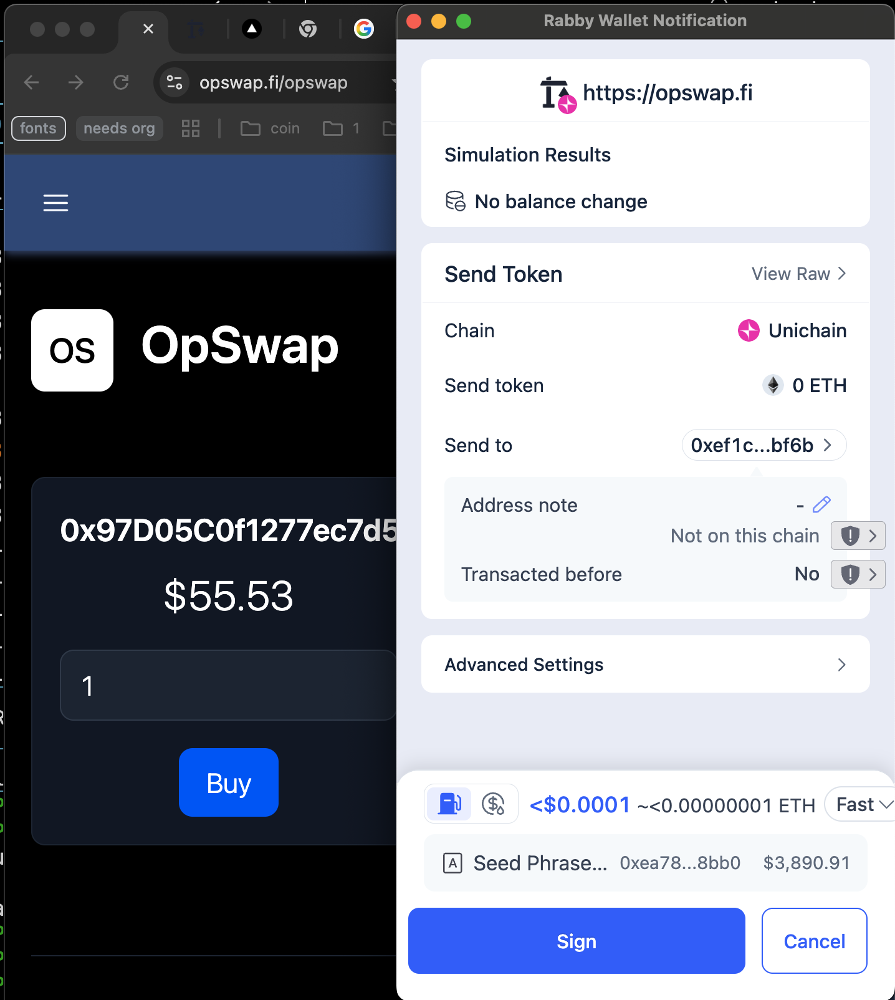
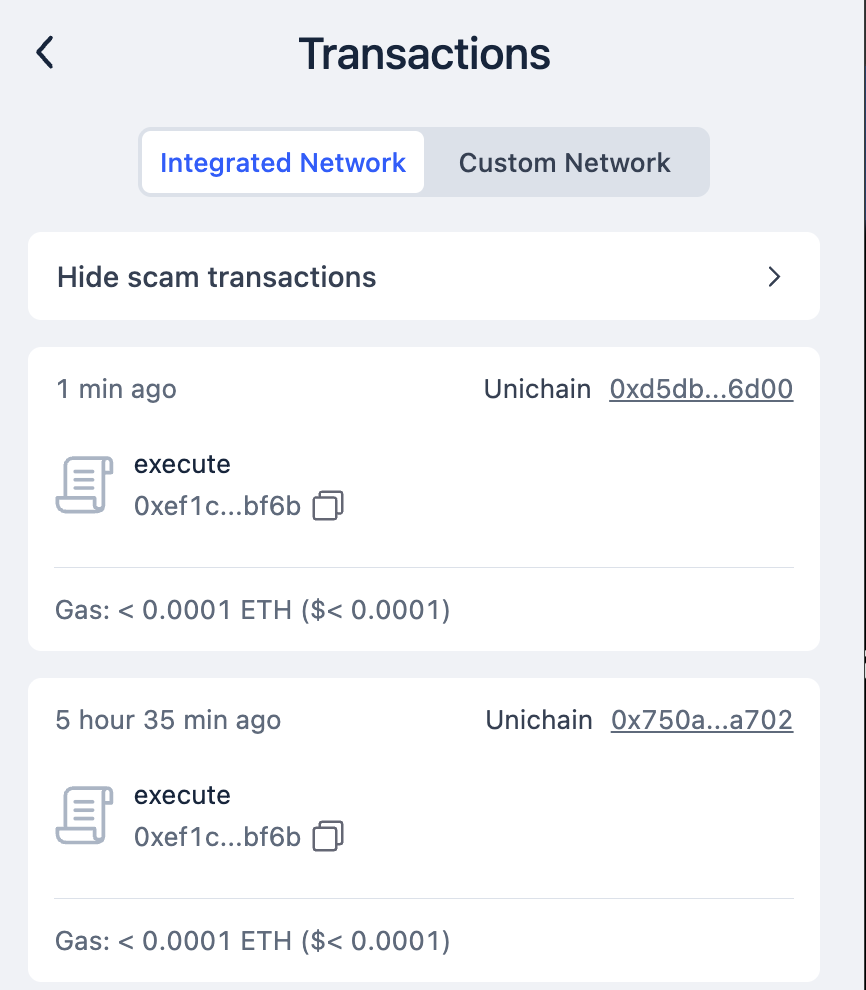

# 🎯 OpSwap - Decentralized Options Trading Platform
Welcome to OpSwap! (No Partner Integrations)

We're excited to have you. Let's jump into it.

https://opswap.fi/opswap (see UI section below)

[Demo Video https://youtu.be/buTX0BUm0xU](https://youtu.be/buTX0BUm0xU)

OpSwap is the only American Options market on Uniswap. 
It is deployed on Unichain Mainnet!

So it doesn't get lost: 

Many thanks to TWADE, SAUCEPOINT, RAPHAEL for all their hard work and help this cohort. I learned a lot and am extremely grateful for being a part of this course. 
I will be continuing my work on this project and might even try to find other hooks to try and build.

Important file locations:
```
packages/foundry/contracts
packages/foundry/test
packages/foundry/scripts
packages/nextjs/app/opswap - React UI
packages/nextjs/contracts/deployedContracts.ts - the Deployed contract addresses/abis
```


## Ok, so how does it work?
OpSwap allows a user to swap "cash" (USDC) for an ERC20 based option.
The option is a GreekFi option (See https://greek.fi), meaning it's fully collateralized.
This means that in order to buy an option, it must be backed by collateral.
This is where the Hook comes in!
The OpSwap hook is a _beforeSwap based hook (similar to EulerSwap and Constant Sum Swap by Saucepoint).
1. The Hook accepts cash (as USDC)
2. Based on the chosed option, the hook calculates a price using Black-Scholes
3. Then an outputAmount of option based on price and input cash 
4. The Hook interacts with the GreekFi Options protocol to mint/collateralize WETH for options (outputAmount)
5. Options are then settled to the user

The process above is also done in reverse for an option->cash swap as well!

# User Interface

The ugliest UI (see https://opswap.fi/opswap) was created to demonstrate the ability to:
1. show the option prices from Uni Pools
2. swap USDC for option tokens

The swap "works" in that it does call execute to the Universal Router. 
Permit2 and Allowances have not been programmed in yet. I trust that end to end everything works based on testing (see below).
Many UI enhancements are needed: such as showing which exact option (not just the address) you are buying. 
I was simply happy that prices were showing.




# Has this been tested?
(Test results are below.)

What tests were created?
1. Pricing tests to verify that the Black Scholes Pricing works as intended
2. EthMainnet fork end-end testing
3. Unichain fork end-end testing
4. Most importantly Deployed Unichain testing

Summary: Not only individual functional tests were created, but tests to verify the functionality of swapping on the actual Universal Router (yes, that UR!) on EthMainnet and Unichain Mainnet with the Hook! 
In addition, using a deployed Hook on Unichain with the Universal Router. 
Also we created Callback for the PoolManager as an additional way to test in all the above fork-tests.

```bash

mla@Mahmouds-Mac-mini foundry % forge test
[⠊] Compiling...
No files changed, compilation skipped

Ran 11 tests for test/OptionPrice.t.sol:OptionPriceTest
[PASS] testBlackScholesATMCall() (gas: 53769)
[PASS] testBlackScholesATMPut() (gas: 53516)
[PASS] testBlackScholesDebug() (gas: 51019)
[PASS] testBlackScholesExpiredATMCall() (gas: 6299)
[PASS] testBlackScholesExpiredITMCall() (gas: 51461)
[PASS] testCDF() (gas: 22192)
[PASS] testExpNegOne() (gas: 16793)
[PASS] testExpNegZero() (gas: 5935)
[PASS] testPrice() (gas: 49627)
[PASS] test_ln() (gas: 104368)
[PASS] test_normCDF_BlackScholes_values() (gas: 19698)
Suite result: ok. 11 passed; 0 failed; 0 skipped; finished in 557.82ms (3.33ms CPU time)

Ran 4 tests for test/OpHookUni.t.sol:OpHookTest
[PASS] testPrice() (gas: 395159)
[PASS] testPrices() (gas: 351479)
[PASS] testRouterSwap() (gas: 518335)
[PASS] testSwapCallback() (gas: 1526059)
Suite result: ok. 4 passed; 0 failed; 0 skipped; finished in 638.38ms (4.71ms CPU time)

Ran 4 tests for test/OpHookUniDeployed.t.sol:OpHookTest
[PASS] testPrice() (gas: 514251)
[PASS] testPrices() (gas: 470568)
[PASS] testRouterSwap() (gas: 512525)
[PASS] testSwapCallback() (gas: 1524249)
Suite result: ok. 4 passed; 0 failed; 0 skipped; finished in 639.23ms (4.88ms CPU time)

Ran 4 tests for test/OpHook.t.sol:OpHookTest
[PASS] testPrice() (gas: 248599)
[PASS] testPrices() (gas: 384354)
[PASS] testRouterSwap() (gas: 425868)
[PASS] testSwapCallback() (gas: 1414783)
Suite result: ok. 4 passed; 0 failed; 0 skipped; finished in 884.36ms (1.87ms CPU time)

Ran 4 test suites in 885.80ms (2.72s CPU time): 23 tests passed, 0 failed, 0 skipped (23 total tests)
```


## ⚠️ Disclaimer

Use at your own risk. The contracts have not been audited and should not be used in production without proper security review.